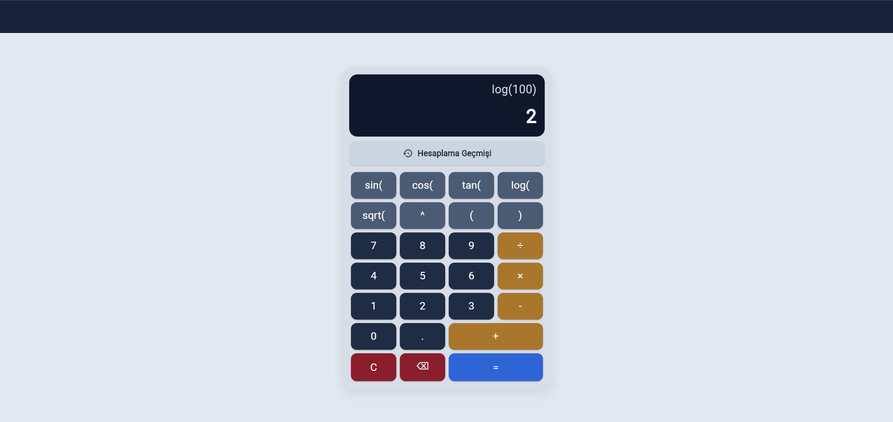
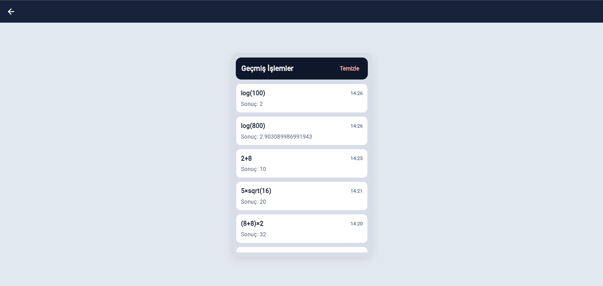

# Flutter Scientific Calculator

A simple Flutter scientific calculator application developed for the **Mobile Application Development** course.

---

## Preview

<p align="center">
  
</p>

<p align="center">
  
</p>

---

## Setup and Run

```bash
flutter pub get
flutter run
```

Run on Chrome:

```bash
flutter run -d chrome
```

---

## Features

- Scientific calculator interface
- Basic arithmetic operations
- Trigonometric calculations
- Logarithm and square root operations
- Calculation history screen

---

## Project Report

The project report is included in the repository.

[Open Project Report](ProjectReport/1030520986_ProjeRaporu.pdf)

---